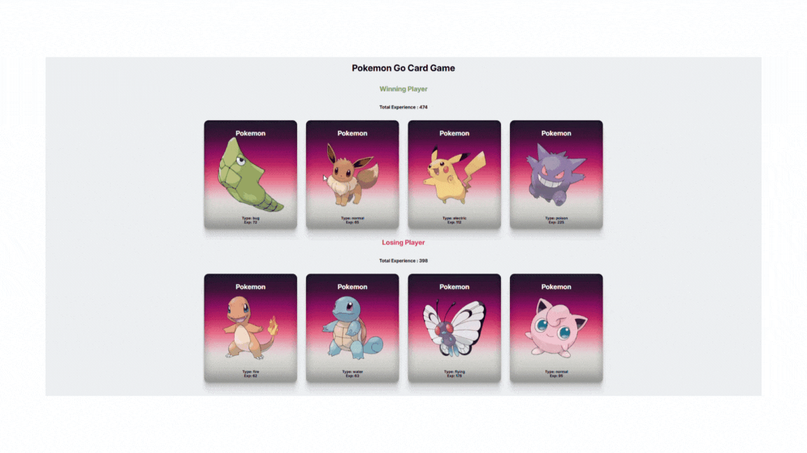

# Pokémon Experience Game


This project was created using the **React** library. It covers the use of **props in React** and utilizes data fetched externally through an **API**.

### 🎮 About the Project

This project is designed as a game model where experience points of 8 different Pokémon are compared to determine the winning and losing teams.

- **4 vs. 4 teams** are formed, and the team with the highest experience points wins.
- **Every time the page is refreshed**, the teams are randomly matched again.

---

### ⚙️ Features

- **Use of Props**: Demonstrates data passing through props in React.
- **API Data Fetching**: Dynamic data fetching through an API.
- **Random Team Matching**: Teams are randomly re-matched with each page refresh.

---

### 🚀 Installation and Usage

Follow these steps to run the project on your local machine:

1. Clone this project:
   ```bash
   git clone https://github.com/username/pokemon-experience-game.git
   ```

# 🖼️ Live Demo


